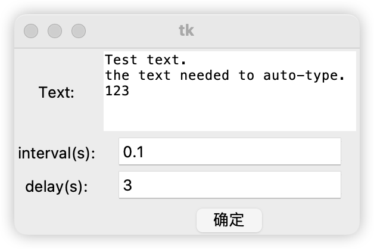

# AutoTypeTool

## 中文简介

自动输入文本, 即使禁止粘贴也可以使用. 

## English Introduction

Automatically simulate input, even if pasting is disabled.

---

## How to use?

### Python

1. install all requirements
2. `python main.py`
3. Fill in the text that needs to be entered automatically, the interval between each character, and the delay before starting the input.

Or you can use `autoType(text, interval, delay)` from `AutoTypeTool` package. 

### Application

not finished yet.

---

# TO DO

## Now

- [x] 基础的自动输入功能
- [x] 可调节输入速率(防止应用屏蔽)
- [x] 从文件中读取文本
- [ ] 打包exe文件(Windows)

## Maybe

- [x] 提供可视化文本框输入文本
- [ ] 解决MacOS中没法输入中文的问题